<!-- body{ font-family: "Times New Roman", Times, serif; } p{ font-family: "Times New Roman", Times, serif; margin: 10px 10px 15px 20px; } h3{ margin: 5px; } h2{ margin: 10px; } h1{ margin: 10px 0px 0px 20px; } div.main-body{ align:center; margin: 30px; } hr{ margin:20px 0px 20px 0px; } -->

  

Neural Network with One Hidden Layer
====================================

CS 440/640 Programming assignment 1  
Faisal Mushayt  
Abdulshaheed Alqunber  
Deemah Al Dulaijan  
March 6th 2019

* * *

Problem Definition
------------------

In this project We were required to implement a Neural Network(NN) that consists of one hidden layer and classifies different dataset. Implementing the NN allows us to explore how the accuracy and general performance of the NN changes as we experiment with different parameters values such as learning rate or applied some form of regularization and cross validation.

#### our overall goals of this project:

1.  Understand how neural networks work
2.  Implement a simple neural network apply backpropagation algorithm to train a neural network
3.  Understand the role of different parameters of a neural network, such as epoch and learning rate.

* * *

Method and Implementation
-------------------------

We created a NN class that randomly initializes the weight and bias matrices we need. The class has methods to train the NN, compute its cost, give predictions, compute the sigmoid and its derivative, and finally, score the performance of the trained NN.

**The NN class has the following methods:***   \_\_init\_\_(self, input\_dim, output\_dim, hidden\_nodes=None)
*   compute\_cost(self,X, y)
*   predict(self,X)
*   train(self,X,y,num\_epochs,learning\_rate=0.01, lamda=0.01)
*   sigmoid(self, x)
*   sigmoid\_derivative(self, x)
*   score(self, y, y\_pred)

the backpropagation algorithm used in the class is as following:  
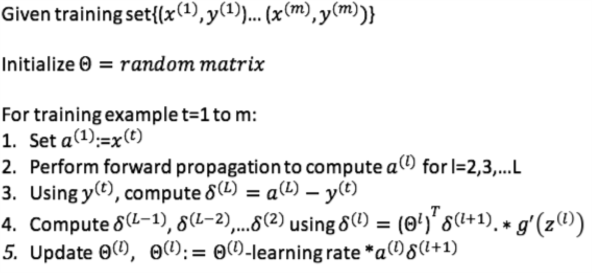  
it uses **sigmoid** as activation function  
Cost is computed as following:  
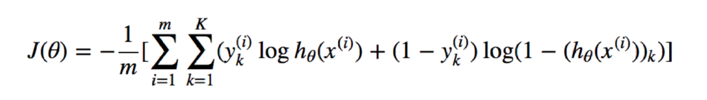  
Accuracy is defind as:  
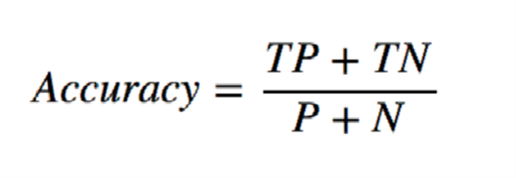  

**additional methods outside the class were implemented as a helper in for testing:***   plot\_confusion\_matrix(cm, classes, normalize=False, title='Confusion matrix', cmap=plt.cm.Blues)
*   crossval\_folds(N, n\_folds, seed)
*   list\_by\_index(X, y, idx)
*   plot\_decision\_boundary(model, X, y)
*   runNN(hidden\_nodes, learning\_rate, lamda, linear = True)
*   digit\_nn(hidden\_nodes, learning\_rate, lamda, num\_epochs)

* * *

Experiments
-----------

We begin by creating the NN and training it with backpropogating through the hidden layer to the input layer. 5-fold cross validation was used to train the NN for every dataset both linear and nonlinear. We were then able to perform L2 regularization and change different metrics to see how the accuracy of the NN changes. Plots of accuracy vs. #nodes in hidden layer as well as learning rate were generated.

**The layout of the different tests in the ipynb are as following:**2.  create and evaluate model and train it on the linear dataset using 5-folds, 2 hidden nodes, learning rate of 0.01, lamda = 0.0001
3.  create and evaluate model and train it on the nonlinear dataset using 5-folds, 8 hidden nodes, learning rate of 0.01, lamda = 0.0001
4.  run a loop that repeats process 2 with different learning rate values ranging from \[x / 100.0 for x in range(1, 201)\] and compare different accuracies
5.  run a loop that repeats process 2 with different number of hidden nodes ranging from range(1,150,5) and compare different accuracies
6.  repeat process 1 & 2 with lamda = 0, this get rids of the l2 term and convert it to l1 then compute cost
7.  Extra credit: Digit dataset

* * *

Results
-------

List your experimental results. Provide examples of input images and output images. If relevant, you may provide images showing any intermediate steps. If your work involves videos, do not submit the videos but only links to them.

### Linear 5-Fold

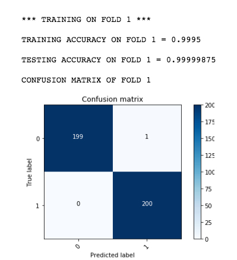 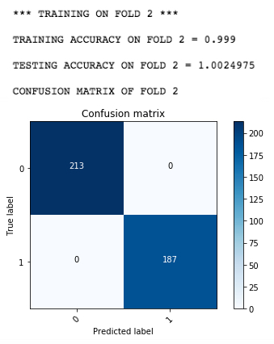 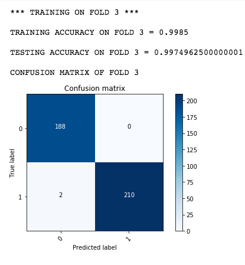 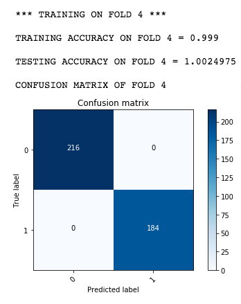 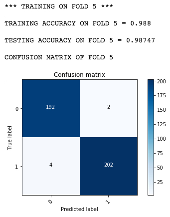 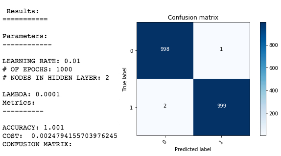 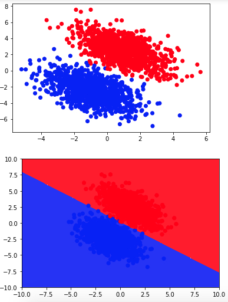

Non-Linear 5-Fold
-----------------

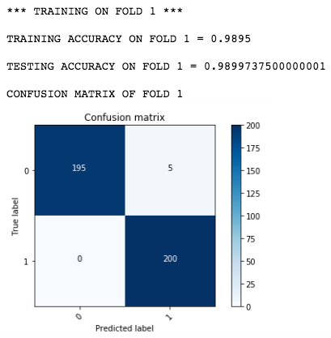 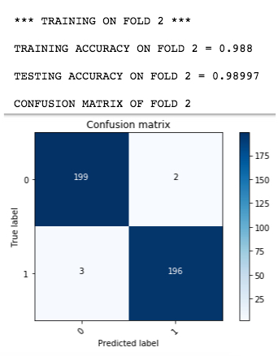 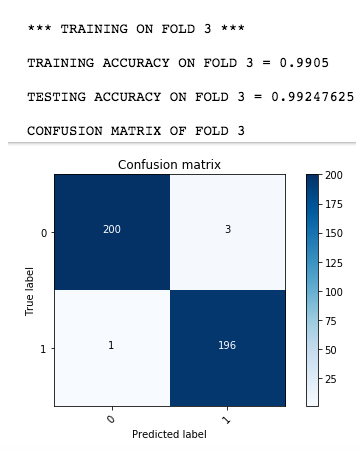 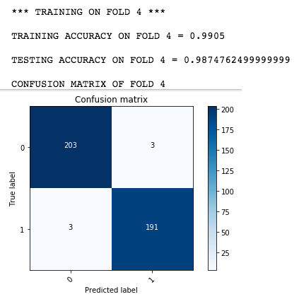 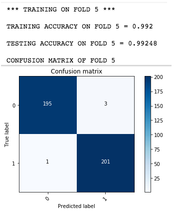 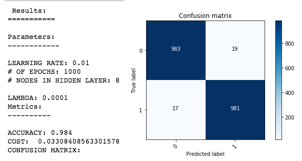 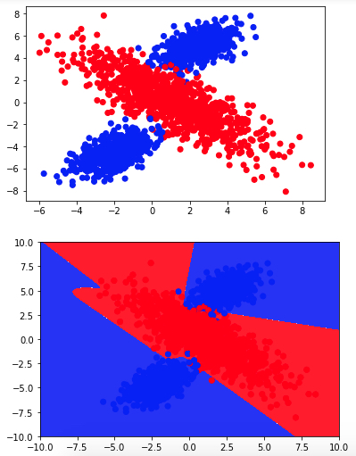

* * *

Analysis Questions
------------------

Question 2: The cross validation procedure enables you to combine the results of five experiments. Why is this useful?

It is useful because we remove some of the data before the training begins for testing. Thus, when we are done with training, the data that we removed can be used to test the performance of the trained NN. By taking the average of the accuracy of k-folds we have a better estimate of our model.

Question 3: What effect does the learning rate have on how your neural network is trained? Illustrate your answer by training your modelusing different learning rates. Use a script to generate output statistics and visualize them.

to explore the answer we ran a loop that repeats process 2 with different number of hidden nodes ranging from range(1,150,5) and compare different accuracies and ran another loop but this time with different values for learning rate and produced the following two graphs  
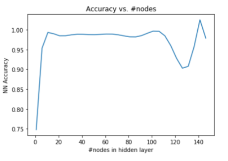 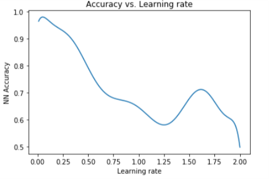

Question 4: What is overfitting and why does it occur in practice? Name and briefly explain 3 ways to reduce overfitting. Overfitting:

Overfitting is casued when the model fits the available data but does not generalize well to predict new data (it memorize the data), it violates Occam's razor. This happens when for example we include more adjustable parameters (features) than are ultimately optimal, or by using a more complicated approach than is ultimately optimal.

1\. Cross Validation is a useful way to reduce overfitting.

2\. Regularization, such as the L2 regularization.

3\. Training with more data. More training data can aid in helping the network correctly classify pairs.

Question 5: How differently does your model perform before and after implementing L2 regularization?

Not a huge difference in the linear and nonlinear data

### before l2

##### linear

  
ACCURACY: 1  
COST: 0.0024794155703976245  

##### Nonlinear

  
ACCURACY: 0.984  
COST: 0.03308408563301578  

### after l2

##### linear

  
ACCURACY: 1  
COST: 0.002422697334000391  

##### Nonlinear

  
ACCURACY: 0.99  
COST: 0.0.028193072059087092  

Question 6 Extra-Credit: Results and Performance of AI System
-------------------------------------------------------------

Discussion: Since our results on the nonlinear and linear datasets were too good we decided to do the extra credit question and we also got a very good results with a very low cost.

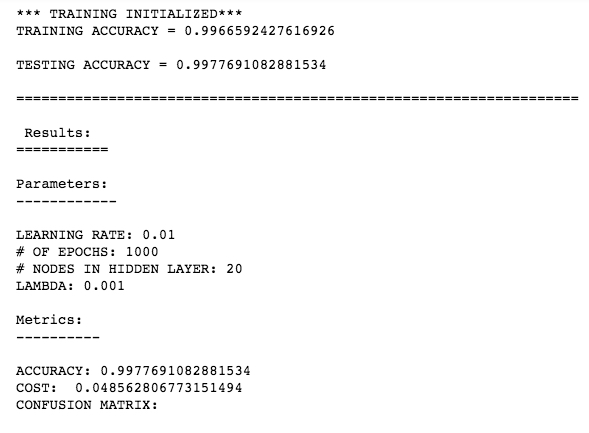 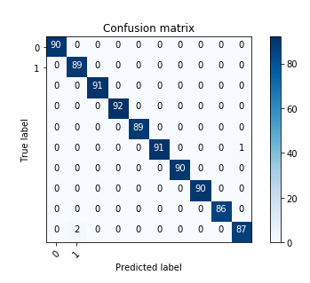 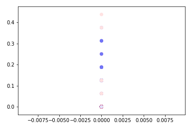

* * *

Discussion
----------

#### *   Strength and Weakness of our method:

##### Strength:

Our implementation showed pretty good results for both linear and nonlinear data. The decision boundaries shows that our model is generalized and have high accuracy. Further, we learned a lot about the theories part about how each of Neural Network, Linear Regression and Logistic Regression works and related.

##### Weakness:

We do not think that our model is weak for the given dataset, it produced very high accuracy with a low number of nodes. However there is a concern about why the accuracy increased when the number of nodes was above 120.

#### *   Expectation:

Overall, I think our implementations and test results are really successful because we have pretty good decision boundaries and accuracies. We were so confident and decided to do the extra credit question. We also learned how the learning rate and the number of hidden nodes infulence the results and how to choose proper learning rate and hidden nodes number. The lower the learning rate the better the accuarcy.

#### *   Potential future work:

We would love to test our implementation on additional datasets and see how if it going to produce a good model. We also want to add additional hidden layers and see the impact of it.

* * *

Conclusions
-----------

The concept of Neural network may sounds scary; however, once you understand the math it becomes pretty easy and fun to work with. We learned that Logistic regression is a neural network with two layers (input, output). We know understand how the forward and backpropagation works and the difference between l2 and l1 regularization. We observed that the nonlinear dataset requires more hidden nodes than the linear dataset. In addition, we learned how the parameters like learning rate can impact the accuracy of a model.

* * *

Credits and Bibliography
------------------------

*   [http://www.chioka.in/differences-between-l1-and-l2-as-loss-function-and-regularization/](http://www.chioka.in/differences-between-l1-and-l2-as-loss-function-and-regularization/) accessed on March 6th, 2019
*   [https://en.wikipedia.org/wiki/Overfitting#Machine\_learning](https://en.wikipedia.org/wiki/Overfitting#Machine_learning) accessed on March 6th, 2019

* * *